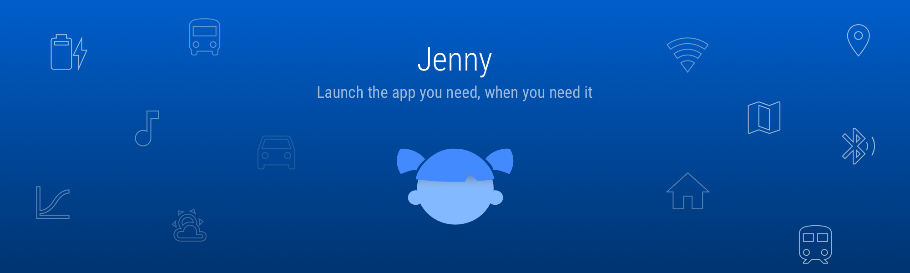
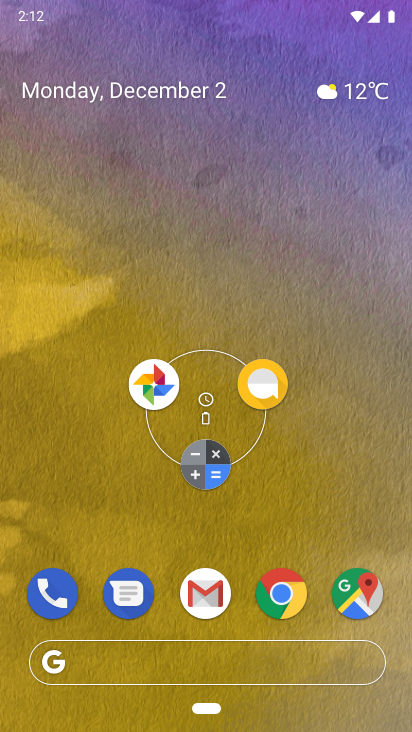
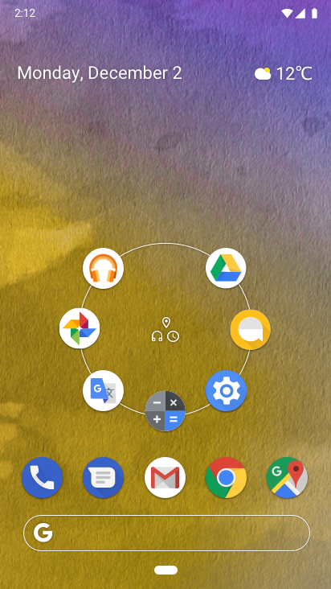

### 
 
Present the apps you need based on location, device sensors, time of day and special sauce, right in the center of your home screen.
 
 

   
 
 
 
## How does it work? 
Jenny analyses your app usage patterns by combining your location, the time on the day, sensors using **On-Device Machine Learning**.
Apps you need is put in the foreground, right at the center of the home screen. Making it faster and easier to open apps.
 
 
**Privacy** is very importaint. Jenny will work even though some sensor permissions are denied. The Machine Learning will run on the phone allowing Jenny to **work offline** and improve privacy.
 
 
 
## What is used? 
WiFi
- SSID
- Signal

GPS
- Localization

Bluetooth
- Connected device
- Profile

Date and Time
- Time of day
- Day of week

Ambilight
- Dark or well-lit environment

Accelerometer/Screen orientation/Activity recognition
- Phone is laying on a table - Face up
- Phone is beeing held in the hand, and the user is standing/sitting, walking, running, car (passenger) or public transport

Chargning and battery state
- Battery low
- is Charging

